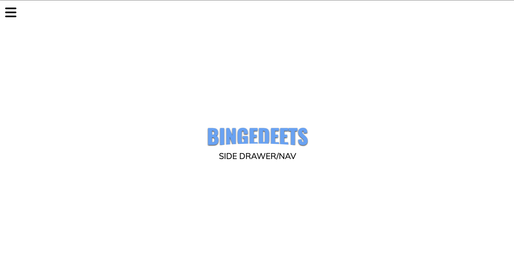

# Side Drawer Navigation



A sleek and modern side drawer navigation menu designed for web applications. Built with HTML, CSS, and JavaScript, this project features a multi-layered sliding menu with smooth animations and a responsive design. Perfect for mobile-first or interactive web designs, this navigation component is both functional and visually appealing.

## Key Features
- **Multi-Layered Drawer**: Includes nested navigation layers with distinct styles for each layer.
- **Smooth Sliding Animation**: Transitions for opening and closing the drawer add a modern touch.
- **Responsive Design**: Optimized for various screen sizes, including mobile and desktop.
- **Interactive UI**: Easy-to-use open and close buttons for toggling the navigation.

## Technologies Used
- **Frontend**: HTML, CSS (with advanced animations and transitions).
- **JavaScript**: Handles menu toggling and interaction logic.

## How to Run
1. Clone the repository:
   ```bash
   git clone https://github.com/yourusername/Side-Drawer-Nav.git
   cd Side-Drawer-Nav
   ```
2. Open `index.html` in your browser to explore the navigation.

## Live Demo
Check out the [Live Demo here](https://chrisroland.github.io/Side-Drawer-Nav/)

## Contributions
- Feel free to **open issues** for any bugs or feature suggestions.
- **Pull requests** are welcome for improvements or additional features.
- This project is **open-sourced**, and I welcome **constructive feedback** and **collaborations**!

Thank you for exploring this project! ❤️